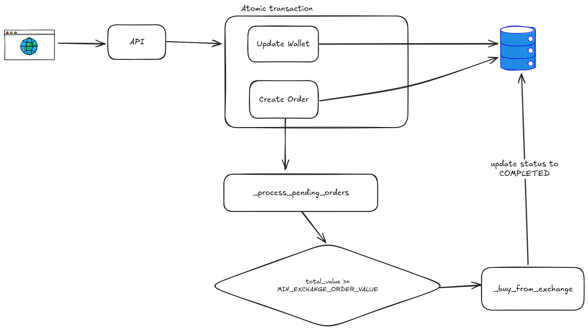
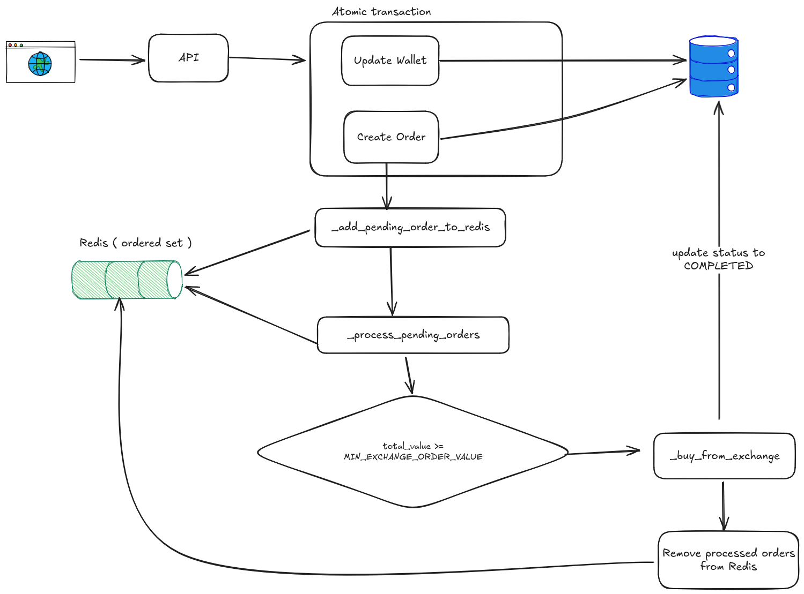

# AbanTether

This is an exchange simulation for AbanTether interview

[](https://github.com/cookiecutter/cookiecutter-django/)
[](https://github.com/astral-sh/ruff)

License: MIT

# Run It Locally 

- First build and run local docker compose

```shell
docker compose -f docker-compose.local.yml up --build
```

- Then migrate and create a superuser
```shell
docker compose -f docker-compose.local.yml run --rm django python manage.py migrate
docker compose -f docker-compose.local.yml run --rm django python manage.py createsuperuser
```

- Now login into admin panel and create a wallet for your superuser
- After that you can test API from [http://localhost:8000/api/docs/](http://localhost:8000/api/docs/)
- To run the automatic tests :

```shell
docker compose -f docker-compose.local.yml run --rm django pytest abantether/orders/tests/
```
# Business Logic

### V1
> You can access this logic at commit `26418aa3367c`



### V2

